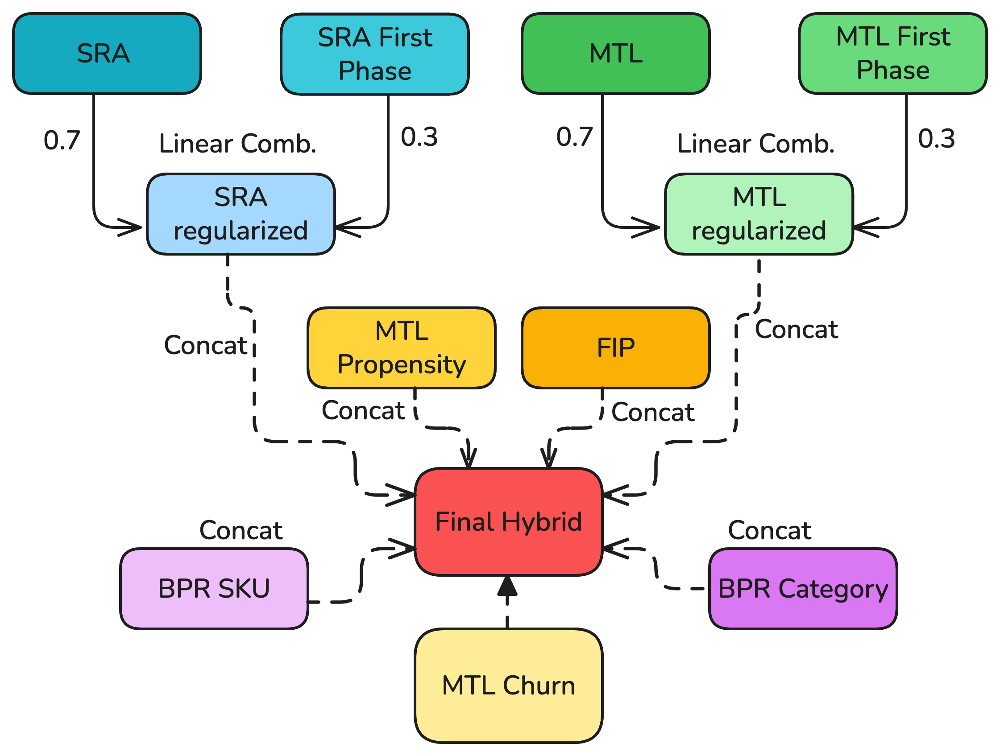

# ACM RecSys Challenge 2025 [EmbedNBreakfast Team]
<p align="center">
  
</p>
<p align="center">
    
</p>

## Challenge Description
This [challenge](https://recsys.synerise.com/), organized by [Synerise](https://www.synerise.com/), promotes a unified approach to behavior modeling by introducing **Universal Behavioral Profiles**, compact user representations derived from diverse interaction data, such as product purchases, cart activity, page views, and search queries. These profiles are designed to generalize across a wide range of predictive tasks common in modern enterprises, including churn prediction, product propensity, and more.

In this competition, participants are tasked with generating an embedding which summarizes user behaviour from the provided event data. These representations will serve as inputs to a simple, fixed neural network, which is trained and evaluated on several tasks:

* **Open Tasks** (disclosed during the competition):

  * **Churn Prediction**: Predict whether an active user will stop purchasing in the next 14 days.
  * **Product Propensity**: Predict which products a user is likely to buy next.
  * **Category Propensity**: Predict which product categories a user is likely to purchase from.

* **Hidden Tasks** (undisclosed until the competition ends):
  Additional predictive tasks used to test the generalization capability of the submitted representations.

Model training and evaluation are automated. Participants focus solely on submitting high-quality, task-agnostic user embeddings that generalize across both known and unknown tasks.

## Team members

We participated in the challenge as **EmbedNBreakfast**, a team of 8 MSc students from Politecnico di Milano:

* **[Simone Colecchia](https://github.com/colsim01)**
* **[Mauro Orazio Drago](https://github.com/madratak)**
* **[Paolo Gennaro](https://github.com/zFireFist01)**
* **[Jihad Founoun](https://github.com/jihadfounoun)**
* **[Ernesto Natuzzi](https://github.com/ernesto1717)**
* **[Luca Pagano](https://github.com/Lp1807)**
* **[Sajad Shaffaf](https://github.com/sajad002)**
* **[Giuseppe Vitello](https://github.com/peppisparrow)**

We worked under the supervision of:

* **[Maurizio Ferrari Dacrema](https://github.com/maurizioFD)** (Assistant Professor)
* **[Andrea Pisani](https://github.com/andreapisa9)** (PhD student)

## Final Model
Our final submission is based on a hybrid approach that combines multiple embedding models to capture different aspects of user behavior. This configuration may not represent the definitive optimal architecture but rather the most effective one developed within the given timeframe.

<p align="center">
    
</p>

The hybrid model combines:
- **GRU-based models** for capturing temporal patterns and sequential behavior
- **BPR models** for collaborative filtering on products and categories
- **First Phase models** to leverage historical data for new user interactions

Specifically, in respect to the image above, we have:
- **Sequence Reconstruction Autoencoder (SRA)**: A model which includes a GRU encoder and decoder, trained with a reconstruction loss to capture sequential patterns in user behavior.
- **MultiTask Learning (MTL)**: A model that extends the SRA. It includes a GRU encoder, with attention mechanism, and three small decoder for the challenge open tasks.
- **Future Interaction Prediction (FIP)**: Alternative to the SRA model where given N-1 months of user interactions, the model predicts the next month interactions. It uses a GRU encoder and decoder, and uses MSE loss for target.
- **BPR models**: Two Matrix Factorization models, with BPR as loss, specifically one for SKU and one for Category, whose propensity scores are concatenated to the embeddings for improving propensity tasks.

This ensemble approach allows us to create robust **Universal Behavioral Profiles** that generalize well across the diverse prediction tasks in the challenge.

# Create Final submission
We need to run different models since the hybrid is a combination of all our best results. For creating the best hybrid you need to first compute all the submodels.

Most of the code has already set the parameters to obtain the exact embeddings we used for the final submission. So, in some of the code important steps, such as validation, are not often present. However, you can change the parameters to obtain different embeddings.

## Datasets
### Descriptions and Naming Conventions
To generate the final submissions, we need to prepare the datasets and embeddings. In this description, we describe the necessary datasets and a name convention to follow for the embeddings.
#### Only Relevant Clients
- **grouped**: This dataset is the one used for the final submission. It contains only the relevant clients and their interactions of the whole 6 months. The name convention for this dataset is `grouped`.
- **grouped_split**: This dataset is the one used for training GRU3H and GRU Future. It contains only the relevant clients and their interactions of first 5 months. The name convention for this dataset is `grouped_split`.

#### All Clients
- **groupedALL**: This dataset is the one used for the final submission. It contains all the clients and their interactions of the whole 6 months. The name convention for this dataset is `groupedALL`.
- **groupedALL_split**: This dataset is the one used for training GRU Future. It contains all the clients and their interactions of the first 5 months. The name convention for this dataset is `groupedALL_split`.
- **groupedALL_only_last_month**: This dataset is the target used for the training GRU Future. It contains only the relevant clients and their interactions of the last month, with counting features of the whole 6 months (i.e. create the dataset with the whole data and then filter for the last month). The name convention for this dataset is `groupedALL_only_last_month`.

#### Old dataset
- **groupedALL_Old**: This dataset is the one used for the final submission of the 'First Phase' models. It contains all the clients and their interactions of the whole 6 months of the first stage dataset. The name convention for this dataset is `groupedAll_OLD`.
- **grouped_OLD_split**: This dataset is the one used for the final submission of the 'First Phase' models. It contains only the relevant clients and their interactions of the first 5 months of the first stage dataset. The name convention for this dataset is `grouped_OLD_split`.
### Datasets preparation
Please in order, run the following .py files to prepare the datasets. The datasets will be saved in the --result_dir parameter, which you can set to your desired path. 
1. Product Event Dataset: for generating sku and category events
   ```bash
   python -m gru_preprocessing.events.sku_events --data_dir <path/to/ubc_data> --result_dir <path/to/save/results> --data_input_dir <path/to/parquet/data/for/dataset>
   ```
2. Visit Event Dataset: for generating page visit events
    ```bash
    python -m gru_preprocessing.events.visit_events --data_dir <path/to/ubc_data> --result_dir <path/to/save/results> --data_input_dir <path/to/parquet/data/for/dataset>
    ```
3. Search Event Dataset: for generating search events
    ```bash
    python -m gru_preprocessing.events.search_events --data_dir <path/to/ubc_data> --result_dir <path/to/save/results> --data_input_dir <path/to/parquet/data/for/dataset>
    ```

Then, to group them into the training datasets, you need to run
```bash
python -m gru_preprocessing.grouped.create_grouped --data_dir <path/to/ubc_data> --result_dir <path/to/save/results> --normalizer "yeo"/"minmax"
```

For our final submission as normalizer we used 'yeo' for all the models but SRA ones, where we used 'minmax'. This choice is based on the chronological order of the models we trained and the limited timeframe we had to optimize the models.
## Regularized Models
For this section you need to run models run on both dataset

### SRA models
#### SRA
```bash
python -m models.SRA.best_conf.standard_conf --embeddings_folder path/to/save/embeddings --dataset_all <groupedALL> --dataset <grouped>
```
#### SRA First Phase
```bash
python -m models.SRA.best_conf.first_phase --embeddings_folder path/to/save/embeddings --dataset_all <groupedALL_Old> --dataset <grouped>
```

### FIP model
```bash
python -m models.FIP.best_conf.sub_fip \
  --embeddings_folder path/to/save/embeddings \
  --grouped_only_rel_submission_dir <grouped> \
  --input_dir <groupedALL_split> \
  --target_dir  <groupedALL_only_last_month>
```

### MTL models
#### MTL
```bash
python -m models.MTL.best_conf.MTL_default_params \
  --data_dir path/to/ubc_data \
  --embeddings_folder path/to/save_model_and_embeddings \
  --train_dir_dataset <grouped_split> \
  --submission_dir_dataset <grouped> \
  --use_new_slope_columns
```
#### MTL First Phase
```bash
python -m models.MTL.best_conf.MTL_default_params \
  --data_dir path/to/ubc_data \
  --embeddings_folder path/to/save_model_and_embeddings \
  --train_dir_dataset <grouped_OLD_split> \
  --submission_dir_dataset <grouped>
```
#### MTL Propensity
```bash
python -m models.MTL.best_conf.MTL_propensity \
  --data_dir <path/to/ubc_data> \
  --embeddings_folder path/to/save_model_and_embeddings \
  --train_dir_dataset <grouped_split> \
  --submission_dir_dataset <grouped>
```
#### MTL Churn
```bash
python -m models.MTL.best_conf.MTL_churn \
  --data_dir path/to/ubc_data \
  --embeddings_folder path/to/save_model_and_embeddings \
  --train_dir_dataset <grouped_split> \
  --submission_dir_dataset <grouped>
```

### BPR models
#### BPR SKU
```bash
python -m models.BPR.bpr_sub --results-csv models/BPR/bpr_sku.csv \
    --embeddings-folder <bpr_sku_embeddings> \
    --data_path <data_path>
    
```
#### BPR CATEGORY
```bash
python -m models.BPR.bpr_sub --results-csv models/BPR/bpr_category.csv \
    --embeddings-folder path/to/save/embeddings \
    --category \
    --data_path path/to/ubc_data
    
```

## Build final hybrid
```bash
python -m models.hybrid.generate_final_sub \
  --sra_dir <path_to_sra_embeddings> \
  --sra_first_phase_dir <path_to_sra_first_phase_embeddings> \
  --fip_dir <path_to_fip_embeddings> \
  --mtl_dir <path_to_mtl_embeddings> \
  --mtl_first_phase_dir <path_to_mtl_first_phase_embeddings> \
  --mtl_prop_dir <path_to_mtl_prop_embeddings> \
  --mtl_churn_dir <path_to_mtl_churn_embeddings> \
  --bpr_sku_dir <path_to_bpr_sku_embeddings> \
  --bpr_category_dir <path_to_bpr_category_embeddings> \
  --output_dir <path_to_output_directory>
```
